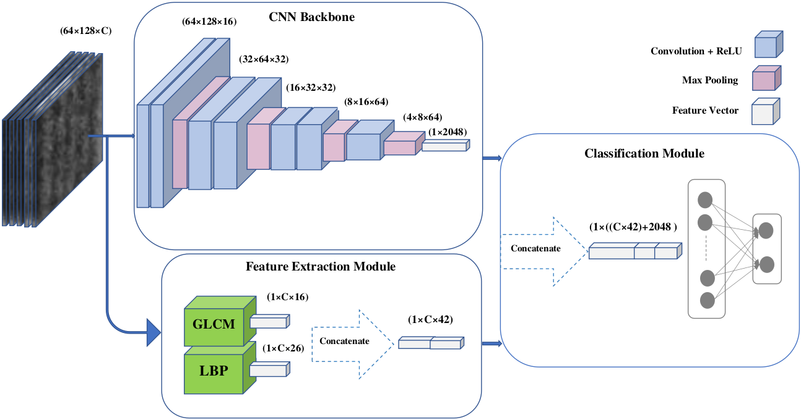

# LodgedNet

LodgedNet is an architecture for crop lodging prediction from UAV-acquired images of wheat and canola using a DCNN augmented with handcrafted texture features. The paper is available [here](http://openaccess.thecvf.com/content_CVPRW_2019/papers/CVPPP/Mardanisamani_Crop_Lodging_Prediction_From_UAV-Acquired_Images_of_Wheat_and_Canola_CVPRW_2019_paper.pdf).

## Getting Started
The proposed architecture has been designed to work with 5-channel data: red, blue, green, red edge, and near infrared.

### Prerequisites

The main dependencies of LodgeNet are numpy, pandas, and pytorch and torchvision. See _**requirements.txt**_ for the list of requirements.

## Authors

* [**Farhad Maleki**](https://github.com/FarhadMaleki) - *Initial work* 
* [**Sara Mardanisamani**](https://github.com/mardanisamani) - *Initial work* 
* [**Sara Kassani**](https://github.com/sara-kassani) - *Initial work*

